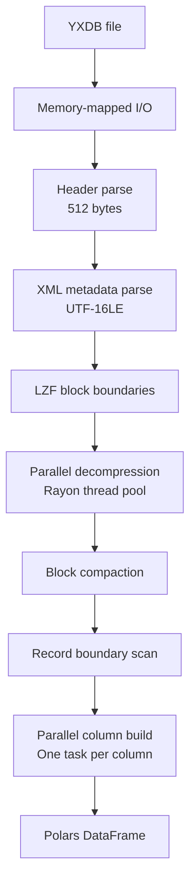
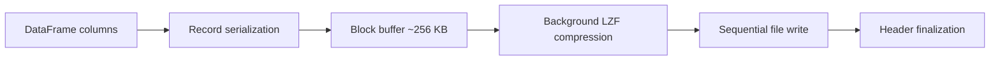

# Architecture

SigilYX is structured as a Rust workspace with three crates and a Python wrapper:

```
sigilyx/              Workspace root
  sigilyx/            Core Rust library (reader, writer, field types)
  sigilyx-python/     PyO3 + pyo3-polars bindings
  python/sigilyx/     Python wrapper module (API, Polars plugin registration)
  benchmarks/rust/    Benchmark harness
```

## Read Pipeline



### Stage Details

1. **Memory-mapped I/O** -- The file is memory-mapped using `memmap2`. No heap copies of the raw file data.

2. **Header parse** -- The fixed 512-byte header is read to extract the record count and metadata size.

3. **XML metadata parse** -- The field schema is extracted from UTF-16LE XML following the header. Parsed with `quick-xml`.

4. **LZF block boundary scan** -- Block sizes are read to locate the start of each compressed block. This is sequential but fast (just reading 4-byte sizes).

5. **Parallel decompression** -- All blocks are decompressed in parallel using Rayon. The LZF decompressor uses a vendored C library compiled with `-O3` for maximum throughput.

6. **Block compaction** -- Decompressed blocks are concatenated into a contiguous buffer for efficient sequential access.

7. **Record boundary scan** -- The buffer is walked to locate the start of each record. Fixed-size records use simple arithmetic. Variable-length fields require sequential offset parsing.

8. **Parallel column build** -- Each column is built independently in parallel. Numeric columns are constructed as raw Arrow value buffers + validity bitmaps, avoiding `Vec<Option<T>>` intermediates. String columns use SIMD-accelerated UTF-16-to-UTF-8 transcoding (SSE2) for the ASCII fast path.

## Write Pipeline



1. **Record serialization** -- DataFrame columns are interleaved into the YXDB fixed+variable record format.

2. **Pipelined compression** -- When a block buffer reaches ~256 KB, it's sent to a background thread for LZF compression via `mpsc::sync_channel`. The main thread continues serializing the next block.

3. **Sequential write** -- Compressed blocks are written in order. An uncompressed fallback is used if compression would increase size.

4. **Header finalization** -- After all records are written, the header is seeked back and updated with the final record count and metadata size.

## Python Bindings

The Python layer uses two mechanisms:

- **pyo3-polars** -- Zero-copy Polars DataFrame transfer via the Arrow C Data Interface. This is the fastest path and avoids any serialization.

- **Arrow IPC** -- For PyArrow and Pandas output, data is serialized as Arrow IPC bytes on the Rust side and deserialized on the Python side. This adds a copy but is still very fast.

The Python `__init__.py` registers Polars namespace plugins (`@pl.api.register_dataframe_namespace`, `@pl.api.register_lazyframe_namespace`) and top-level aliases (`pl.read_yxdb`, `pl.scan_yxdb`) on import.

## Key Design Decisions

| Decision | Rationale |
| --- | --- |
| Memory-mapped I/O | Avoids double-buffering; OS page cache handles caching |
| C LZF via FFI | The Rust LZF implementations benchmarked 20-40% slower than the C reference |
| Direct Arrow arrays | Avoids `Vec<Option<T>>` -> Arrow conversion overhead; builds validity bitmap directly |
| pyo3-polars | Zero-copy Python bridge; no serialization for the Polars path |
| Rayon for parallelism | Work-stealing thread pool; good load balancing for unequal block sizes |
| Pipelined writes | Overlaps compression with serialization for ~30% write throughput improvement |
