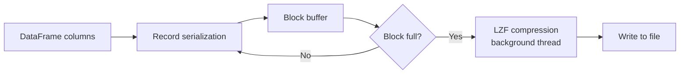

# Writing YXDB Files in Rust

SigilYX can write Polars DataFrames to YXDB files with full round-trip fidelity for all 17 field types.

## Basic Write

```rust
use sigilyx::{read_yxdb, write_yxdb, SpatialMode};

let df = read_yxdb("input.yxdb", SpatialMode::Raw)?;
write_yxdb("output.yxdb", &df, &[])?;
```

The third argument is a slice of `FieldMeta` overrides. Pass `&[]` to let SigilYX infer field types from the DataFrame schema.

## Schema Overrides

If you need explicit control over YXDB field types (e.g., to force a `V_WString` with a specific max size):

```rust
use sigilyx::{write_yxdb_with_schema, FieldMeta, FieldType};

let schema = vec![
    FieldMeta::new("id", FieldType::Int64),
    FieldMeta::with_size("name", FieldType::V_WString, 256),
    FieldMeta::with_scale("price", FieldType::FixedDecimal, 19, 4),
];

write_yxdb_with_schema("output.yxdb", &df, &schema)?;
```

## Streaming Writer

For writing large DataFrames without holding the entire output in memory:

```rust
use sigilyx::YxdbWriter;
use std::fs::File;
use std::io::BufWriter;

// Create writer (writes header + metadata immediately)
let mut writer = YxdbWriter::new("output.yxdb", &first_batch)?;

// Write first batch
writer.write_batch(&first_batch)?;

// Write additional batches
for batch in batches {
    writer.write_batch(&batch)?;
}

// Finalize (updates header with total record count)
writer.finish()?;
```

The streaming writer uses pipelined compression: a background thread compresses the previous block while the main thread serializes the next one.

## Arrow IPC to YXDB

Write Arrow IPC bytes directly to a YXDB file (useful for cross-language pipelines):

```rust
use sigilyx::write_yxdb_from_ipc;

let ipc_bytes: &[u8] = /* Arrow IPC message */;
write_yxdb_from_ipc("output.yxdb", ipc_bytes)?;
```

## Write Pipeline Architecture



Key characteristics:

- Records are serialized into a buffer until it reaches ~256 KB (0x40000 bytes)
- Full blocks are compressed on a background thread via `mpsc::sync_channel`
- The main thread continues serializing while compression runs
- Compressed blocks are written sequentially for correct block indexing
- The header is finalized with the total record count after all blocks are written
