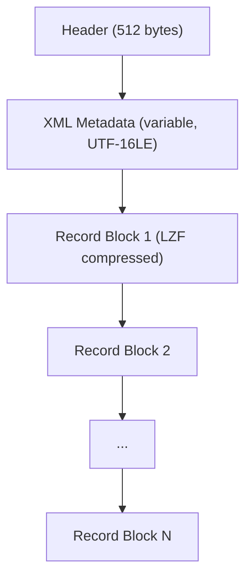

# YXDB File Format Specification

This is a reference specification for the YXDB binary file format, derived from existing open-source implementations.

## Overview

YXDB (Alteryx Database) is a binary file format for storing tabular data with embedded metadata. It uses LZF compression for record blocks and supports 17 distinct field types.

## File Structure



## Header (512 bytes)

The header is a fixed 512-byte structure at the start of the file.

| Offset | Size | Type | Description |
| --- | --- | --- | --- |
| 0 | 21 | bytes | Null bytes |
| 21 | 64 | ASCII | Description: `"Alteryx Database File"` (null-padded) |
| 85 | 4 | u32 LE | File ID / version |
| 89 | 4 | u32 LE | Creation date |
| 93 | 4 | u32 LE | Flags / reserved |
| 97 | 4 | u32 LE | Flags / reserved |
| 101 | 4 | u32 LE | Unknown |
| 104 | 8 | i64 LE | **Record count** |
| 112 | 4 | u32 LE | **Metadata size** (bytes of XML) |
| 116 | 4 | u32 LE | Reserved |
| 120 | 392 | -- | Padding |

The two key fields are:
- **Bytes 104--111**: Record count as little-endian signed 64-bit integer
- **Bytes 112--115**: Size of the XML metadata section that follows

## XML Metadata

Immediately after the 512-byte header is UTF-16LE-encoded XML:

```xml
<?xml version="1.0" encoding="UTF-16"?>
<RecordInfo>
  <Field name="Id" type="Int64" />
  <Field name="Name" type="V_WString" size="1073741823" />
  <Field name="Price" type="FixedDecimal" size="19" scale="6" />
</RecordInfo>
```

### Field Attributes

| Attribute | Required | Description |
| --- | --- | --- |
| `name` | Yes | Column name |
| `type` | Yes | One of the 17 field types |
| `size` | Depends | Max width for strings, precision for decimals |
| `scale` | Depends | Decimal places for `FixedDecimal` |
| `source` | No | Source system (ignored by SigilYX) |
| `description` | No | Field description (ignored by SigilYX) |

## Field Types

See the [Field Type Reference](/field-type-reference) for the complete list with binary encoding details.

## Record Layout

Each record has a fixed-size portion followed by an optional variable-length portion.

### Fixed Portion

Contains all fixed-size fields in schema order. For variable-length fields, the fixed portion contains a 4-byte offset marker:

- **Bit 31 set**: Field has data; lower 31 bits are the byte offset into the variable portion
- **Bit 31 clear**: Field is empty/null

### Variable Portion

Variable-length data follows the fixed portion. Each variable field's data uses a size-prefixed format:

**Small values (size \<= 127 bytes):**

| 1 byte | N bytes |
| --- | --- |
| size | data |

**Large values (size \> 127 bytes):**

| 4 bytes | N bytes |
| --- | --- |
| size \| 0x80000000 | data |

The high bit of the 4-byte size distinguishes it from the 1-byte header.

## LZF Compression

Records are packed into blocks of up to 262,144 bytes (0x40000) of uncompressed data. Each block is independently compressed.

### Block Format

| 4 bytes | Variable |
| --- | --- |
| Compressed size (u32 LE) | Compressed data |

If `compressed_size == 0`, the block is stored uncompressed.

### LZF Algorithm

LZF is a fast, lightweight compression algorithm using literal runs and back-references:

- **Control byte \< 32**: Copy `(control + 1)` literal bytes
- **Control byte \>= 32**: Back-reference with length `(control >> 5) + 2` and offset from the next byte(s)

Each block is independently decompressible, which enables SigilYX's parallel decompression strategy.

## Writing

1. Write 512-byte header placeholder (zeros)
2. Build and write UTF-16LE XML metadata
3. Serialize records into blocks; compress each with LZF; write compressed blocks
4. Seek back to header and write final record count (bytes 104--111) and metadata size (bytes 112--115)

## References

- [Alteryx/OpenYXDB](https://github.com/alteryx/OpenYXDB) -- C++ implementation by Alteryx
- [NedHarding/Open_AlteryxYXDB](https://github.com/AlteryxNed/Open_AlteryxYXDB) -- C++ implementation (GPL-3.0)
- [yxdb-go](https://github.com/tlarsendataguy-yxdb/yxdb-go) -- Go implementation (MIT)
- [yxdb-py](https://github.com/tlarsendataguy-yxdb/yxdb-py) -- Python implementation (MIT)
- [yxdb-net](https://github.com/tlarsendataguy-yxdb/yxdb-net) -- .NET implementation (MIT)
